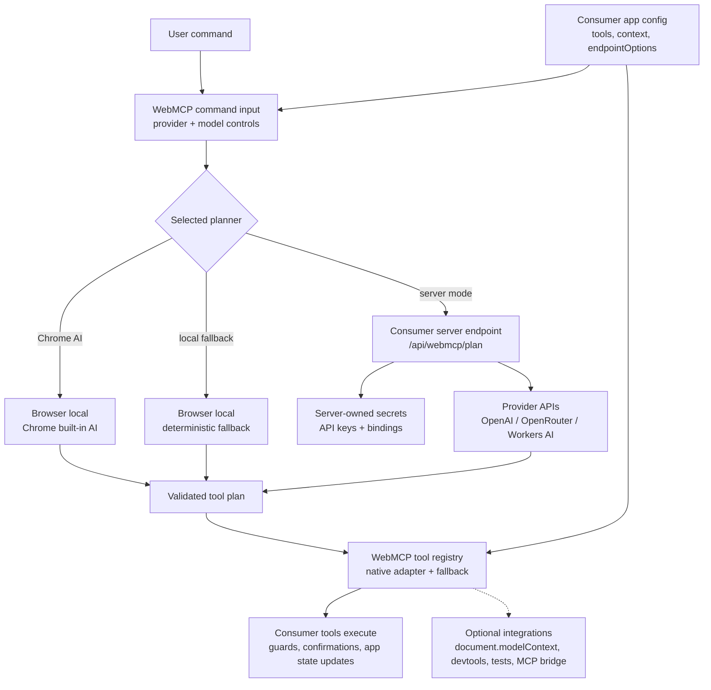

# WebMCP Kit

WebMCP Kit is a local-first TypeScript toolkit for exposing real web app actions as safe, typed WebMCP tools. It lets apps register narrow actions with schemas, guards, confirmations, and lifecycle cleanup, then progressively connects those tools to native browser WebMCP, local devtools, tests, and planner-driven demos.

## Status

This repository is an early MVP. Chrome WebMCP and Chrome built-in AI are emerging browser capabilities, so the kit is designed as progressive enhancement:

1. Use native WebMCP when `document.modelContext.registerTool` is available.
2. Keep a fallback registry for unsupported browsers, tests, demos, and devtools.
3. Use Chrome built-in AI planning when `LanguageModel` is available.
4. Fall back to deterministic local planning when browser AI is unavailable.

The current aim is not to replace app code or invent a new agent runtime. The kit gives existing web apps a small adoption layer for making selected user-facing actions callable by browsers, tests, local tools, or planners while the app keeps ownership of validation, confirmation, authorization, and execution.

What is in this repo now:

- Core tool registration, native WebMCP wrapping, fallback invocation, validation, confirmations, events, planners, and form helpers.
- Optional Vue, React, and Svelte lifecycle helpers that delegate to core registration.
- Devtools, Playwright helpers, and a local MCP-style bridge for development and testing.
- An Astro + Vue + Cloudflare demo that exercises planner providers, Cloudflare Workers AI, and fallback behavior.

Packages are still private while the MVP API settles. See [Package Publishing Shape](./Dev-Docs/PACKAGE-PUBLISHING.md) for the release-readiness checklist and package boundary notes.

## How It Fits

Consumers keep ownership of app state, tools, secrets, and approved planner endpoints. WebMCP Kit provides the browser-facing registration layer, the fallback registry, the command input, diagnostics, tests, and planner clients.



## Quick Start

```ts
import { defineTool, registerTool } from 'webmcp-kit'

registerTool(
  defineTool({
    name: 'search_products',
    description: 'Search the local product catalog.',
    inputSchema: {
      type: 'object',
      properties: {
        query: { type: 'string' }
      },
      required: ['query'],
      additionalProperties: false
    },
    annotations: {
      readOnlyHint: true
    },
    execute(input) {
      return searchProducts(String(input.query))
    }
  })
)
```

For tools that change important state, add confirmation metadata and configure one app-level approval handler:

```ts
import { defineTool, registerTool, setConfirmationHandler } from 'webmcp-kit'

registerTool(
  defineTool({
    name: 'create_invoice',
    description: 'Create a draft invoice for a customer and add it to the invoice list.',
    inputSchema: {
      type: 'object',
      properties: {
        customerName: {
          type: 'string',
          description: 'The customer name to invoice.'
        },
        amount: {
          type: 'number',
          minimum: 0.01,
          description: 'The invoice amount.'
        }
      },
      required: ['customerName', 'amount'],
      additionalProperties: false
    },
    confirmation: {
      required: true,
      reason: 'Creating an invoice changes business state.'
    },
    async execute(input) {
      return createInvoice(input)
    }
  })
)

setConfirmationHandler(async function confirmTool(tool, input, reason) {
  return showConfirmationModal({
    title: `Run ${tool.name}?`,
    body: reason,
    preview: JSON.stringify(input, null, 2)
  })
})
```

## Core API

- `createWebMCPKit(options)` initializes the kit and optional planner provider.
- `defineTool(tool)` validates and preserves a typed tool definition.
- `registerTool(tool)` registers with native WebMCP when available and always stores the tool in the fallback registry. Native registration passes through WebMCP `annotations` such as `readOnlyHint` and unregisters with `AbortSignal` when supported by the browser.
- `invokeTool({ toolName, input, confirmed })` invokes fallback-registered tools for devtools, tests, and demos.
- `setConfirmationHandler(handler)` configures one global async confirmation provider for tools with `confirmation.required`.
- `listTools()` returns active registrations.
- `getRegistrySnapshot()` returns support mode, tool count, and registered tools.
- `getIntegrationHealthReport()` returns developer-facing diagnostics for missing tools, weak schemas, missing confirmation handlers, unavailable tools, and planner status.
- `assertWebMCPIntegration()` throws when the current integration has blocking errors.
- `isWebMCPSupported()` checks for native WebMCP registration support.
- `createBestPlanner()` uses Chrome built-in AI when available, otherwise a deterministic local planner.
- `defineWebMCPCommandInput()` registers a ready-made `<webmcp-command-input>` web component for planner-driven commands.
- `installWebMCPKitTestBridge()` exposes a kit-specific test bridge for Playwright and local QA.

## Planner Output

Planners normally return one tool invocation:

```ts
{
  toolName: 'select_items',
  input: { ids: ['item_4'] },
  confidence: 0.9,
  reason: 'Selected the matching item from the current app context.'
}
```

For requests that require multiple app actions, planners can return a bounded chained plan. The demo executor runs each step in order and stops on the first blocked, failed, or unavailable step:

```ts
{
  toolName: 'tool_sequence',
  input: {},
  confidence: 0.9,
  reason: 'Select matching invoices, then update their status.',
  steps: [
    {
      toolName: 'select_invoices',
      input: { ids: ['inv_104'] },
      confidence: 0.9,
      reason: 'Selected the matching Stark Industries invoice.'
    },
    {
      toolName: 'update_selected_invoice_status',
      input: { status: 'paid' },
      confidence: 0.9,
      reason: 'Marked the selected invoice as paid.'
    }
  ]
}
```

Each step is validated against its tool schema before execution. Confirmation is still enforced per tool invocation, so a chained plan cannot bypass approval for mutating tools.

## Integration Health

Use the health report while wiring WebMCP into an app:

```ts
import { getIntegrationHealthReport } from 'webmcp-kit'

const report = getIntegrationHealthReport({ planner: kit.planner })

if (report.status !== 'ready') {
  console.table(report.diagnostics)
}
```

The report shape is intentionally small:

```ts
interface IntegrationHealthReport {
  status: 'ready' | 'warning' | 'error'
  summary: string
  diagnostics: Array<{
    severity: 'info' | 'warning' | 'error'
    title: string
    detail: string
    action: string
    toolName?: string
  }>
}
```

The devtools overlay shows the same report, so developers can see whether tools are registered, schemas are strict, confirmations are installed, and the selected planner is usable.

## Framework Helpers

The framework subpaths are intentionally thin lifecycle adapters. They register tools through `webmcp-kit` and unregister them when the owning component scope is disposed.

- `webmcp-kit/vue`: `useWebMCPTool()` for Vue effect scopes, with reactive `when` support.
- `webmcp-kit/react`: `useWebMCPTool()` for React components.
- `webmcp-kit/svelte`: `useWebMCPTool()` for Svelte components, including readable-store `when` support.

See [Vue](./docs/vue.md), [React](./docs/react.md), [Svelte](./docs/svelte.md), and [Framework Extensions](./docs/framework-extensions.md).

For copy-paste snippets, see [Examples](./docs/examples.md).

## Browser WebMCP References

WebMCP Kit tracks the browser proposal while keeping a local fallback for unsupported environments:

- [Chrome WebMCP Imperative API](https://developer.chrome.com/docs/ai/webmcp/imperative-api)
- [Chrome WebMCP Declarative API](https://developer.chrome.com/docs/ai/webmcp/declarative-api)
- [Chrome WebMCP best practices](https://developer.chrome.com/docs/ai/webmcp/best-practices)
- [Chrome WebMCP evals](https://developer.chrome.com/docs/ai/webmcp/evals)
- [When to use WebMCP and MCP](https://developer.chrome.com/docs/ai/webmcp/compare-mcp)

## Planner Providers

Developers can pass a planner provider when initializing the kit:

```ts
import { createWebMCPKit } from 'webmcp-kit'

const kit = await createWebMCPKit({
  planner: {
    provider: 'openrouter',
    model: 'nvidia/nemotron-3-super-120b-a12b:free',
    auth: {
      mode: 'user-key',
      apiKey: userProvidedKey
    }
  }
})
```

User-key mode is intentionally simple and does not need a server, but the key is visible to the browser page. For app-owned production secrets, use server mode:

```ts
await createWebMCPKit({
  planner: {
    provider: 'openai',
    model: 'gpt-5.4-mini',
    auth: {
      mode: 'server',
      endpoint: '/api/webmcp/plan'
    }
  }
})
```

See [Planner Providers](./docs/planner-providers.md) for OpenRouter, OpenAI, OpenAI-compatible, Cloudflare Workers AI, Chrome built-in AI, and local fallback examples.

The demo also exposes `cloudflare-binding` in local, preview, and production deployments: a server-endpoint-only mode where the browser selects from approved Cloudflare Workers AI models and the Astro Cloudflare runtime endpoint uses an `AI` binding.

In production, the demo keeps planner controls hidden by default. To temporarily expose the provider/model controls in a browser, set `localStorage.setItem('webmcp:admin', 'true')` and reload the page.

## Ready-Made Command Input

Apps that want a drop-in natural-language command box can register the framework-agnostic web component:

```ts
import { defineWebMCPCommandInput } from 'webmcp-kit'

defineWebMCPCommandInput()
```

```html
<webmcp-command-input
  provider="openai"
  model="gpt-5.4-mini"
  endpoint="/api/webmcp/plan"
></webmcp-command-input>
```

When `provider` and `model` are initialized by attributes or properties, the component treats them as app-owned configuration and does not show those settings to the user. If they are omitted, the component shows provider/model controls only when there is a real choice.

Chrome built-in AI is detected from the browser `LanguageModel` API and appears automatically when available. Consumers can hide it with `showChromeAI: false`.

For local development, leave `provider` and `model` unset and pass the endpoint options your app supports so developers can switch server-backed planners from the command box:

```ts
input.configure({
  context: getPlannerContext,
  endpoint: '/api/webmcp/plan',
  endpointOptions: [
    {
      label: 'GPT-5.4 mini',
      model: 'gpt-5.4-mini',
      provider: 'openai'
    },
    {
      label: 'Nemotron 3 Super 120B A12B',
      model: 'nvidia/nemotron-3-super-120b-a12b:free',
      provider: 'openrouter'
    },
    {
      label: 'GLM 4.7 Flash',
      model: '@cf/zai-org/glm-4.7-flash',
      provider: 'cloudflare-binding'
    },
    {
      label: 'Auto',
      provider: 'auto'
    },
    {
      label: 'Local deterministic',
      provider: 'local'
    }
  ]
})
```

The demo follows this server-endpoint pattern in dev mode and passes an app-owned planner option for its demo-specific deterministic planner. Preview and production can pass the app-owned planner/provider/model to keep those choices hidden from end users. If the consumer provides only one option and Chrome AI is hidden or unavailable, the options panel is not rendered.

For app context, assign a property before or after mounting:

```ts
import type { WebMCPCommandInputElement } from 'webmcp-kit'

const input = document.querySelector<WebMCPCommandInputElement>('webmcp-command-input')

if (input) {
  input.context = function getPlannerContext() {
    return {
      route: location.pathname,
      selectedIds: getSelectedIds()
    }
  }
}
```

The component uses the active WebMCP registry, plans against registered tools, invokes the returned step or bounded `tool_sequence`, and emits `webmcp-command-plan`, `webmcp-command-step`, `webmcp-command-result`, and `webmcp-command-error` events. `run(message, { signal })` accepts an `AbortSignal` for cancelling commands before planning or between sequence steps; remote planner fetches receive the same signal.

## Playwright Helpers

Apps can install the test bridge in development or test builds:

```ts
import { installWebMCPKitTestBridge } from 'webmcp-kit'

if (import.meta.env.DEV || import.meta.env.MODE === 'test') {
  installWebMCPKitTestBridge()
}
```

Playwright tests can then inspect and invoke tools through the page:

```ts
import { invokeWebMCPTool, waitForWebMCPTool } from 'webmcp-kit/testing/playwright'

await waitForWebMCPTool(page, 'select_items')
await invokeWebMCPTool(page, {
  toolName: 'select_items',
  input: { ids: ['item_4', 'item_7'] },
  source: 'planner'
})
```

The test bridge does not accept caller-provided confirmation bypasses. Confirmed tools still go through the app confirmation handler or browser confirmation fallback.

## Local Demo

```sh
npm install
npm run dev
```

Open:

```txt
http://localhost:60001/
```

The demo exposes invoice, product search, cart, and support-ticket tools. It shows whether the app is running with native WebMCP or fallback mode, then lets you run natural-language commands against the registered tools.

## Cloudflare Deployment

Use these settings for the Worker build:

```txt
Root directory: /
Install command: npm ci
Build command: npm run build
Deploy command: npm run deploy
```

`npm run deploy` runs Wrangler from the demo workspace, so Astro's generated deploy config and `demo/wrangler.toml` are used together.

## Development

```sh
npm run test
npm run test:e2e
npm exec tsc -- --noEmit
```

Production builds are intentionally not part of the normal verification loop yet.
